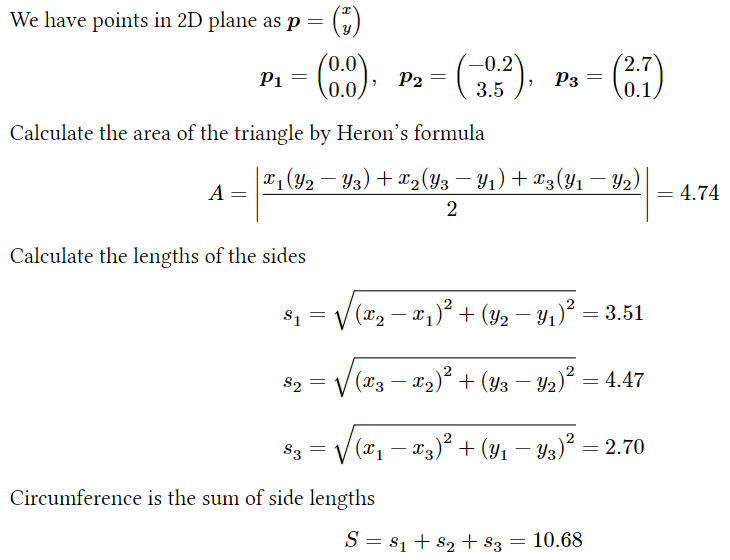

# Pysplainer

Converts Python calculations into beautiful explanations and reports

----

Pysplainer allows you to create beautiful reports in PDF, PNG and SVG format out of your Python calculations. It is as easy as adding a decorator to your Python functions and you immediately gain access to an alternative, _explainable_, mode of running your calculations. With the explainable mode enabled, you can use the trace of your calculations (including the nested functions if you wish) together with the powerful [Typst typesetting system](https://github.com/typst/typst) to show the algorithm and any intermediate results in its full glory.

## Example

You just need to decorate your code with `@explainable` decorator and mark the comments and data you want to output with `##!`:

```python
@explainable
def triangle_metrics(x1, y1, x2, y2, x3, y3):
  ##! We have points in 2D plane as $bold(p) = vec(x, y)$
  ##! $ bold(p_1) = vec({x1:.1f}, {y1:.1f}), quad bold(p_2) = vec({x2:.1f}, {y2:.1f}), quad bold(p_3) = vec({x3:.1f}, {y3:.1f}) $
  ##! Calculate the area of the triangle by Heron's formula
  area = abs((x1 * (y2 - y3) + x2 * (y3 - y1) + x3 * (y1 - y2)) / 2)
  ##! $ A = abs((x_1(y_2 - y_3) + x_2(y_3 - y_1) + x_3(y_1 - y_2)) / 2) = {area:.2f} $

  ##! Calculate the lengths of the sides
  side1 = ((x2 - x1) ** 2 + (y2 - y1) ** 2) ** 0.5
  ##! $ s_1 = sqrt((x_2 - x_1)^2 + (y_2 - y_1)^2) = {side1:.2f} $
  side2 = ((x3 - x2) ** 2 + (y3 - y2) ** 2) ** 0.5
  ##! $ s_2 = sqrt((x_3 - x_2)^2 + (y_3 - y_2)^2) = {side2:.2f} $
  side3 = ((x1 - x3) ** 2 + (y1 - y3) ** 2) ** 0.5
  ##! $ s_3 = sqrt((x_1 - x_3)^2 + (y_1 - y_3)^2) = {side3:.2f} $

  ##! Circumference is the sum of side lengths
  circumference = side1 + side2 + side3
  ##! $ S = s_1 + s_2 + s_3 = {circumference:.2f} $

  return area, circumference
```

You can still run the code normally and get regular Python results

```python
>>> triangle_metrics(0.0, 0.0, -0.2, 3.5, 2.7, 0.1)
(4.735, 10.67634)
```

or you can run it in the explainable mode to return an `ExplainableResult` object supporting PDF ouput like:

```python
>>> result = triangle_metrics(0.0, 0.0, -0.2, 3.5, 2.7, 0.1, explainable=True)
>>> result.as_pdf(output="triangle_metrics.pdf")
```



## Instalation

You can add it to your project's environment with your favourite package manager. For example, with `poetry` just do

```bash
poetry add pysplainer
```

or with `pip` you can add it using

```bash
pip install pysplainer
```

## Similar libraries

What `pysplainer` does is in some way smilar to _literate programming_ in the sense that it weaves the documentation/reports together with the code. However, `pysplainer` is driven by a single purpose -- to programatically generate beautiful reports based on static executable code and dynamic inputs. _Literate programming_ has wider purposes and goals and they are more focused on writing code that can be easily read and understood by people potentially unfamiliar with the code or even with coding.  

We can find more about _literate programming_ at

- https://en.wikipedia.org/wiki/Literate_programming

In Python, literate programming libraries might be

- Jupyter notebooks
- PyLit
- PyReport (discontinued)

Another similar concept, but with a different purpose, is document generation:
- https://en.wikipedia.org/wiki/Documentation_generator
- https://homes.cs.washington.edu/~mernst/pubs/test-documentation-ase2011.pdf

## TODO

- [x] Implement trace function
- [x] Add the @explainable decorator to function
- [x] Add an example that outputs lines in typst format
- [x] Implement ExplainableResult.as_pdf()
- [x] Add support for typst templates to generate a pretty pdf
- [x] Make an example with a matrix
- [x] Switch to AST implementation
- [x] Find a way to do this with nested functions
- [x] Find minimum working version of dependancies
- [x] Create an example with a more complex physical calculation
- [x] Add installation instructions
- [x] Add example into README.md
- [ ] Add Github actions for automated formatting, testing, code coverage on deploy
- [ ] Add Github shields for
  - tests: passing
  - code coverage: 99%
  - license: MIT
  - Code style: black
  - pypi version
- [ ] Run multiple env tests with tox
- [ ] Instead of pydantic data model switch to dataclass
- [ ] Move pytest and numpy to dev dependencies
- [ ] Publish lib to PyPi
- [ ] Make a summary of all the situations in which this does not work
- [ ] Make a plan for next steps
- Nice-to-haves:
  - [ ] Caching of converted functions so that same functions are not converted multiple times
  - [ ] Template can be a string that is prepended or a function that is called on ExplainableResult object
  - [ ] Deal with `"` more elegantly in comments than having to define them as `\"`
  - [ ] Try following steps in https://github.com/typst/typst/issues/1158 to make typst compilation completely in memory
  - [ ] Have multiple subsequent lines be treated as one line (so that we can observe the character line limit)
  - [ ] It's not possible to create an explainable closure since the function will not have the local context
 